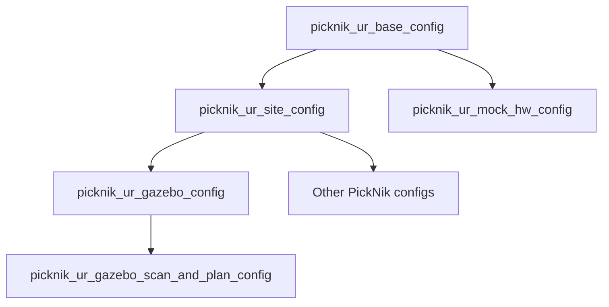

# MoveIt Pro Workspace for Universal Robots Arms

This is a sample user workspace for running MoveIt Pro with a generic Universal Robots (UR) arm.
For more information, refer to the [MoveIt Pro Documentation](https://docs.picknik.ai/).

Instructions for building your own MoveIt Pro configuration can be found [in the getting started guides](https://docs.picknik.ai/docs/getting_started/setup_tutorials/software_installation/).

MoveIt Pro can be used with real robots and full simulators such as Gazebo and NVIDIA Isaac Sim.
For testing purposes, you can also use the [ROS 2 Control Mock Components](https://control.ros.org/master/doc/ros2_control/hardware_interface/doc/mock_components_userdoc.html), which is what this repo is configured to use.

This workspace offers a reasonable starting point for those users looking to develop with MoveIt Pro using custom base and site configurations.
For more information refer to the [online documentation](https://docs.picknik.ai).

## Universal Robots Configuration Packages

This workspace contains several MoveIt Pro configuration packages for UR arms that inherit from each other for different applications.

Specifically:

* `picknik_ur_base_config` contains common configuration for all UR arms, real or simulated.
* `picknik_ur_mock_hw_config` provides overrides for a machine tending application simulated using mock components (no physics).
* `picknik_ur_site_config` extends the base configuration with capabilities for robots with physics and perception.
* `picknik_ur_gazebo_config` extends the site configuration with support for the Gazebo simulator.
* `picknik_ur_gazebo_scan_and_plan_config` extends the Gazebo configuration with an alternate environment for 3D object scanning.
* `picknik_ur_multi_arm_config` is an example configuration for using multiple arms.
* Other hardware-specific configurations, such as the ones used on PickNik's UR arms, inherit from `picknik_ur_site_config`.
